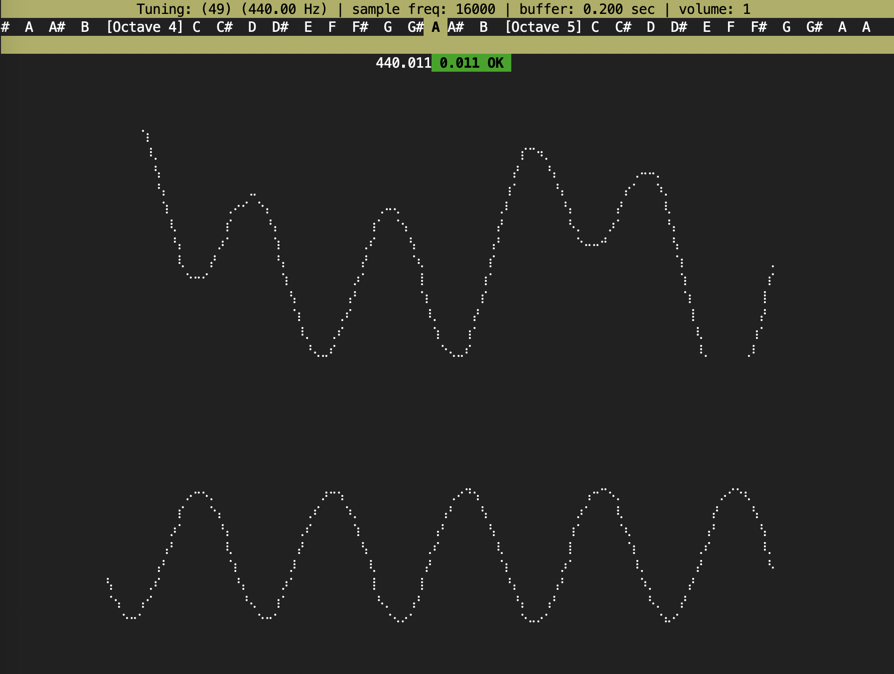

# intuno
**intuno** is a terminal-based note tuning application for pianos and other instruments.  Written in Python, it is available for multiple platforms.

## Installation

The program depends on the `pyaudio` library, which in turn depends on `portaudio`, which on a Mac is installed most easily with Homebrew. After cloning this repository, run:

```
brew update
brew install portaudio
brew link --overwrite portaudio
pip install -r requirements.txt
```

## Tuning

Run **intuno** with:

```
python3 tune.py
```

This defaults to tuning A in Octave 5.  You can optionally specify a different starting note, for instance to start tuning at Middle C, use:

```
python3 tune.py c3
```

The interface shows the currently selected note in the top menu bar, which you can change with the left and right arrow keys.  The raw signal coming from the microphone is rendered with [`plotille`](https://github.com/tammoippen/plotille) and the filtered signal is shown below it.  For a correctly tuned note, you should see a nice, clean waveform with a green OK status next to its estimated frequency:



If the note is out of tune, the bottom waveform will drift, and the frequency estimate will tell you how much you will have to tighten (if the frequency is too low) or loosen (if too high) the string:


